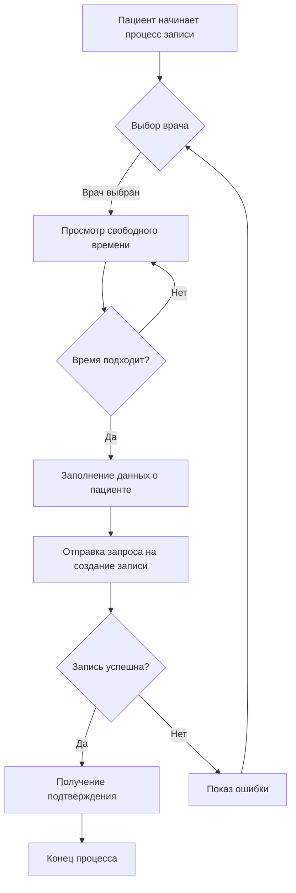

### Activity-диаграмма "Пациент записывается на приём":

```mermaid
flowchart TD
    A[Пациент начинает процесс записи] --> B{Выбор врача}
    B --> |Врач выбран| C[Просмотр свободного времени]
    C --> D{Время подходит?}
    D --> |Да| E[Заполнение данных о пациенте]
    D --> |Нет| C
    E --> F[Отправка запроса на создание записи]
    F --> G{Запись успешна?}
    G --> |Да| H[Получение подтверждения]
    G --> |Нет| I[Показ ошибки]
    H --> J[Конец процесса]
    I --> B
```

В графическом исполнении диаграмма приведена в `activity-diagramm.png`