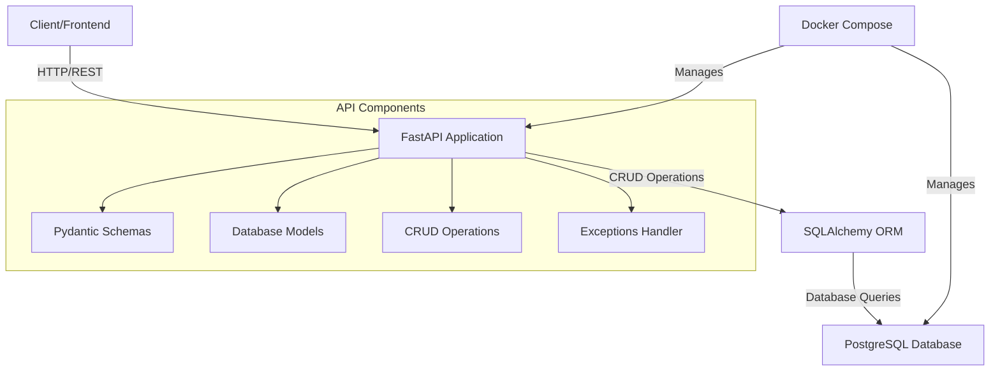

### Архитектурная схема приложения (Mermaid):

```mermaid
graph TD
    A[Client/Frontend] --> |HTTP/REST| B[FastAPI Application]
    B --> |CRUD Operations| C[SQLAlchemy ORM]
    C --> |Database Queries| D[PostgreSQL Database]
    
    subgraph API Components
        B
        E[Pydantic Schemas]
        F[Database Models]
        G[CRUD Operations]
        H[Exceptions Handler]
    end
    
    B --> E
    B --> F
    B --> G
    B --> H
    
    I[Docker Compose] --> |Manages| B
    I --> |Manages| D
```

В файле `architecture-schema.png` приведена схема в графическом исполнении