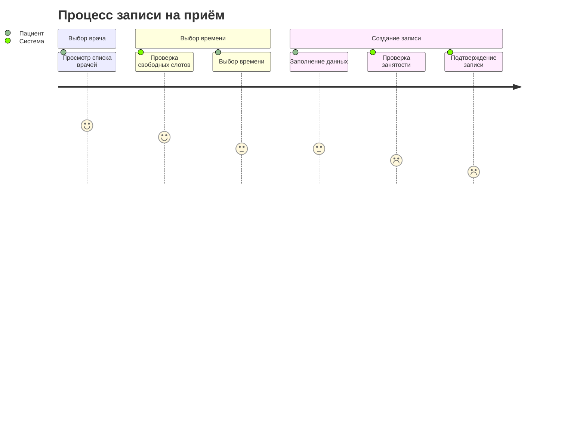

Бизнес-процессы:

Роли и права доступа:

| Роль          | Чтение               | Создание | Изменение | Удаление |
|---------------|----------------------|----------|-----------|----------|
| Пациент       | ✓ (только свои)      | ✓        | -         | -        |
| Администратор | ✓                    | ✓        | ✓         | ✓        |
| Врач          | ✓ (только свои)      | -        | -         | -        |

Диаграмма memraid процесса записи на прием:

В файле `business-process.png` приведена схема в графическом исполнении

**Временные рамки процессов (даны примерно):**\
_Все зависит от количества врачей и от загруженности системы_

| Процесс        | Мин. время | Макс. время | Сред. время |
|----------------|------------|-------------|-------------|
| Поиск врача    | 1 мин      | 10 мин      | 5 мин       |
| Выбор времени  | 2 мин      | 15 мин      | 7 мин       |
| Создание записи| 30 сек     | 3 мин       | 1 мин       |